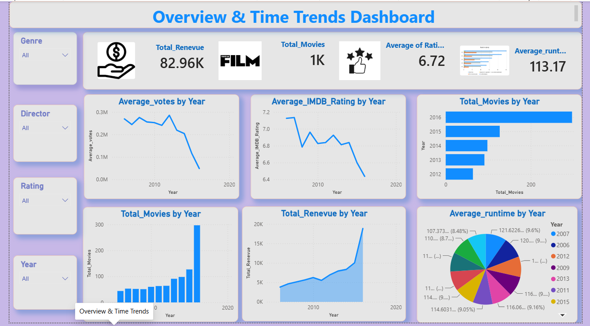

# 🎬 Movie Sales Analysis Dashboard | Power BI

An interactive **Power BI Movie Sales Dashboard** designed to transform raw movie sales and audience data into meaningful business insights. The dashboard provides a centralized view of revenue, sales performance, movie ratings, genres, audience engagement, and yearly trends.

## 📌 Project Overview

The entertainment industry generates large volumes of sales and audience data, making it challenging to identify trends and measure performance effectively.

This project uses **Power BI, DAX, Power Query, and data modeling** to analyze movie data and present insights through interactive dashboards and visualizations.

## 🎯 Objectives

* Analyze overall movie sales performance
* Track revenue trends over time
* Identify top-performing movies
* Compare genre-wise performance
* Analyze movie ratings and audience engagement
* Understand revenue patterns by release year
* Support data-driven decision-making

## 📊 Key KPIs

* **Total Revenue**
* **Total Sales**
* **Revenue Growth Trend**
* **Genre-wise Revenue**
* **Average Movie Rating**
* **Audience Vote Count**
* **Revenue by Release Year**

## 📈 Dashboard Features

### 🎥 Revenue Trend Analysis

Analyze revenue performance over time and identify growth patterns.

### 🏆 Top-Performing Movies

Identify movies contributing significantly to overall revenue and sales.

### 🎭 Genre Performance

Compare revenue and performance across different movie genres.

### ⭐ Ratings & Audience Insights

Explore the relationship between audience ratings, votes, and commercial performance.

### 📅 Year-wise Analysis

Analyze revenue and movie performance across different release years.

### 🔍 Interactive Analysis

Use filters and slicers to explore the data across different dimensions.

## 🛠️ Tools & Technologies

* **Microsoft Power BI**
* **Power Query**
* **DAX**
* **Data Modeling**
* **Data Visualization**

## 💡 Key Insights

* Revenue trends help identify changes in movie performance over time.
* A small number of blockbuster movies can contribute a significant portion of total revenue.
* Audience ratings and engagement provide useful indicators for understanding movie performance.
* Interactive filtering enables deeper analysis across movies, genres, years, and other dimensions.

## 📂 Repository Structure

```text
Movie-Sales-PowerBI/
│
├── README.md
├── LICENSE
├── Movie_Sales_Dashboard.pbix
├── movie_sales_data.csv
└── Screenshots/
    └── dashboard.png
```

> **Note:** File names and folders may vary depending on the files included in the repository.

## 🚀 How to Use

1. Clone or download this repository.
2. Open the `.pbix` file using **Microsoft Power BI Desktop**.
3. Review the dashboard pages and interactive filters.
4. Explore the KPIs, charts, and visualizations.
5. If the dataset is included, refresh the data connection if required.

## 📷 Dashboard Preview

```markdown

```

## 📚 Learning Outcomes

Through this project, I gained practical experience in:

* Data cleaning and transformation using Power Query
* Creating calculated measures using DAX
* Building relationships and data models
* Designing interactive Power BI dashboards
* Creating meaningful KPIs and visualizations
* Extracting actionable insights from business data
* Applying data storytelling techniques

## 👨‍💻 Author

**[Mohd osman]**

If you found this project useful, feel free to ⭐ the repository and share your feedback!

## 📄 License

This project is licensed under the **MIT License**.

> Dataset licensing and third-party data rights remain subject to their respective original terms.
